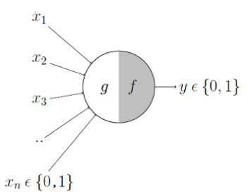
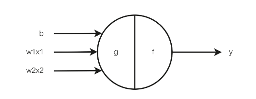
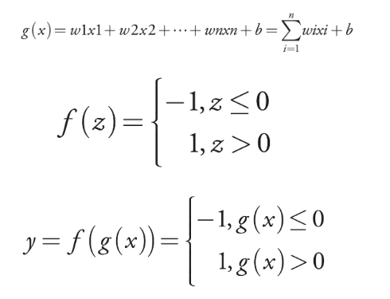

## Prologue

Frank Rosenblatt invents the perceptron in 1958 (foundational breakthrough in AI)

Some of the most fundamental mathematical concepts used in machine learning are:
1. Elemental algebra, calculus, linear algebra
2. Bayes theorem
3. Gaussian distribution

## Chapter 1

- AI finds patterns in data

- Assuming certain things (for example, the data is linearly separable), Rosenblatt's perceptron always converges to a solution.

- What are patterns in data? What does it mean to find patterns?
This depends on the type of data and the problem we are dealing with. Let’s suppose it’s numerical data that varies. In the book, there’s a simple example: a linear relationship between “x1, x2” and “y,” such that y = x1 + 2x2.

- Linear relationship: relation = equation, equation involving only sums and subtractions of variables in their first power (x1, x2, x3, ..., xn).
When the algorithm automatically finds the correct weights (assuming the relationship is linear), it is said that it “learned.” This is an example of regression.

- The precursor of the Rosenblatt perceptron is the neuron or MCP (McCulloh-Pitts model). An attempt at modeling how a real neuron works. The big problem is that it doesn't have the capacity to learn. You have to
configure it manually (theta parameter θ)

MCP:\

g(x) = ∑xi \
f(z) = 0, z < θ; 1, z >= θ \
y = f(g(x)) 

- Rosenblatt's perceptron is an improved MCP, it takes any value as entry (not only 0 or 1), has weights, bias and a learning algorithm to stablish them. 
Graphically the algorithm tries to find the weights and bias that separates the training data.

 - A dataset is linearly separable if there exists a line, plane, or hyperplane that divides it into two or more groups

- "A single layer of perceptrons will always find a linearly separating hyperplane, if the data are linearly separable"
