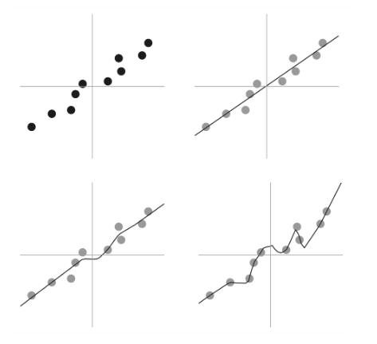
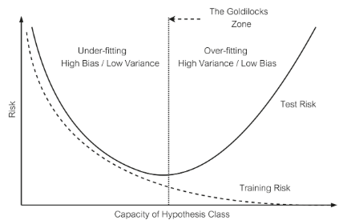

## Chapter 12

### Simple models underfit, complex models overfit (or no?)

- Deep neural networks display some odd behaviours that are not entirely understood to this day
- The first one is grokking, the phenomenon where a neural network, after initially overfitting a training dataset, suddenly and dramatically improves its ability to generalize to new, unseen data
- Another one is related to the size of these networks, the best ones have hundreds of millions or billions/trillions of weights.
The parameters can at times equal or vastly outnumber the instances of data used to train these networks. Standard ML theory says that such networks shouldn’t work the way they do:
They should simply overfit the data and fail to make inferences about, or “generalize to,” new, unseen data.
- Sometimes a simpler model is better because a complex model could overfit (example with the chairs or image below). This is what the theory tell us\

### bias-variance trade-off

- When choosing between a simple or complex model, we want the test error as low as possible
- But how do you choose the correct level of complexity? Bias: the simpler the model the greater the bias. Variance: The more complex the model, the greater the variance
- High bias (i.e., simpler models) leads to underfitting, a higher risk of training error, and a higher risk of test error, whereas high variance (i.e., more complex models) leads to overfitting, a lower risk of training error, and a higher risk of test error
- Standard ML theory says that a model should have just the right number of parameters: Too few, and the model is too simple (high bias) and fails to capture the necessary nuances of the data on which it’s trained. Too many parameters, and the model becomes very complex and learns the patterns in the data with such fine granularity that it fails to generalize to unseen data.
- The bias-variance trade-off represents this. The x axis is the complexity of the model, is called "Capacity of Hypothesis Class" because the more parameters a model has, the more functions can approximate. Increase the number of parameters, and you increase the capacity of the hypothesis class\

- From almost all empirical accounts of traditional machine learning, the bias-variance trade-off seemed to be true. But not for deep neural networks
- In the standard way of thinking, this would only be possible if the process of stochastic gradient descent (which was used to train the network) somehow ended up pruning the number of tunable knobs in the model (implicit regularization). We know this is NOT happening, so its not the explanation
- Regularization: turns a complex model into a simpler one, allowing it to generalize better

### Parameters, hyperparameters and types of networks

- Hyperparameters: knobs that are set by engineers before training begins. These latter include, for example, the architecture of the neural network (which dictates, among other things, the number of layers, the number of neurons per layer, and the way these layers are interconnected), the size of the training data, the precise type of optimization algorithm, and whether one does explicit regularization (such as pruning the number of parameters)
- Parameters: knobs in a model—the weights of a neural network, for example—that get tuned during training
- In this book, we have studied: single-layer perceptron, Hopfield networks, multi-layer perceptron and convolutional neural network. But there are many more.
- Generally, we can classify them in feedforward or recurrent networks
- Feedforward neural networks are those in which the information flows one way, from the input layer to the output
- Recurrent networks allows for feedback connections so that the outputs of neurons not only influence neurons in the layers ahead, but can also serve as inputs to neurons in the same layer or in the layers that came before. This allows recurrent neural networks to “remember” previous inputs, making them useful for problems that involve inputs that vary over time (LSTM)
- Training a model to achieve zero training cost can result in overfitting. To prevent this, the cost function is often modified with the addition of another term to it, called the regularizer

### Self-Supervised learning

- A model is trained using unlabeled data, having it predict missing parts from the context.
- In language, this involves masking words in a sentence (such as “I'm going to walk back ___”) and training the model to predict the missing word.
- In images, the process is similar: pixels or parts of the image are hidden and the model is trained to reconstruct them.
