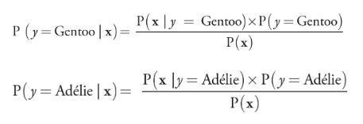

## Chapter 4

### Previous concepts

1. [Bayes theorem](https://www.youtube.com/watch?v=HZGCoVF3YvM&ab_channel=3Blue1Brown)
2. Basics of probability theory (experiment, random variable, [CDF, PDF, PMF](https://www.youtube.com/watch?v=YXLVjCKVP7U&t=17s&ab_channel=zedstatistics), famous distributions (Bernoulli, normal...), [Expected value](https://en.wikipedia.org/wiki/Expected_value), variance, standar deviation)
3. [marginal, conditional](https://www.youtube.com/watch?v=xu-HhF3SpbE&ab_channel=DataMListic) and [joint](https://www.youtube.com/watch?v=CQS4xxz-2s4&ab_channel=IntelligentSystemsLab) probabilities

### Underlying distribution

- In machine learning, we start with data. The distribution of the data we have in hand is representative of some underlying distribution of the data
- Whether it’s a probability mass function for a discrete random variable or a probability density function for a continuous random variable, some well-known and analytically well-understood functions, with characteristic parameters, can be used to describe the probability distributions of the data
- The parameters of a probability distribution model that distribution (p in bernoulli, mean and variance in normal...)

### Estimating the underlying distribution of the data and its parameters in supervised learning

- In supervised learning we are given some labeled data, X. Each instance of X is a d-dimensional vector, meaning it has d components. So, X is a matrix, where each row of the matrix is one instance of the data. Associated with each instance of X is a label, y. This data has an underlying probability distribution P(X, y)
- Since finding the real underlying distribution is very difficult, we assume its type. Then given this assumed distribution there are two main ways of finding its parameters so its adjust to the data (Note: nonparametic distributions exists).
- MLE (maximum likelihood estimation) Frequentist methodology
- MAP (maximum a posteriori) Bayesian methodology
- MLE is powerful when you have a lot of sampled data, while MAP works best with fewer data

### Bayes optimal classifier

- Fun fact: Bayesian decision theory is a field in ML that establishes the bounds for the best we can do with the data we have
- Given the data X [x1, x2, x3... xn] and the classes y, for each class, if we figure out the distribution P(X, y=some class) for each class (class-conditional probability, we could know it, or estimate it using MLE, MAP or other method). We could calculate P(y=some class, X) for all the classes and then choose the one that has the highest probability, using bayes theorem, the probability is:\
\
and we have access to all the elements in the equation
- If we had access to the real underlying distributions, this (bayes optimal classifier) is the best an ML algorithm can do (and still not 100% accurate, imagine for some X for class 1 is 90% and class 2 is 10%, it still can be wrong), however this almost never happens, and here is where we run into trouble. This algorithm gets computationally impossible very quickly
- The more features X has, the more data we need to calculate the probability distribution and its harder to find the probability distribution. For N = 1 we need to find a 2D function, for N = 2 a 3D function and so on. This gets out of hand very quickly.
- This is why we apply some simplification to the algorithm to create a new one called Naive bayes 

### Naive Bayes/Idiot Bayes classifier
- Instead of trying to find P([x1, x2, x3..., xn], y) wich is very difficult, we assume that all features are sampled from their own distributions independently of one another
- This implies that the variation in one feature has nothing to do with variation in other feature, wich is likely not true, but it's the assumption we make so the calculations are simpler
-  Mutual independence assumption: P(x1, x2, x3, x4, x5 | y = A) = P(x1 | y = A) × P(x2 | y = A) × P(x3 | y = A) × P(x4 | y = A) × P(x5 | y = A)
-  To estimate the distribution probabilities of the data, we can model each feature as a continuous random variable, fitting a curve over the histogram or as a discrete random variable, using bins.

