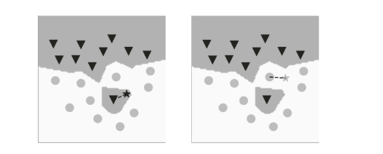
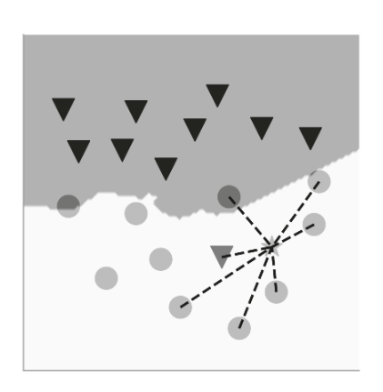

## Chapter 5

### Previous concepts

1. Nothing remarkable

### Voronoi diagram and distances

- In mathematics, a Voronoi diagram is a partition of a plane into regions close to each of a given set of objects ([source](https://en.wikipedia.org/wiki/Voronoi_diagram))
- To measure the distance between points, we can use the euclidean distance or the Manhattan distance
- This distances (and others) can be used to find similarities between data points, the shorter the distance between two points, the more they are alike

### Nearest Neighbord algorithm and the concepts of overfitting and generalization

- Nearest Neighbord is a classification algorithm that classifies a new data point based on its nearest data point. For example, if we have a problem with two classes, 1 and 2, if the nearest data point to our new data point belongs to class 1, then the new data point will be classified as belonging to class 1
- NN finds a nonlinear boundary between classes, however if we have outliers or misplaced datapoints it overfits (meaning the algorithm will missclassify new data points due to the outliers) \
\
- To avoid this we increase the number of nearest neighbors against which to compare the new data point. This is called k-NN, where k is the number of nearest neighbors to compare with (it has to be and odd number)
- k-NN can make some mistakes with the traning data but it generalizes better (predicts best unseen data, even though it makes some mistakes with training data). Generaly, we have to be careful with overfitting specially if the data doesn't have the best quality \
 \
- Theoretically, the more data we have, the better k-NN is, having a similar performance to Bayes classifier. The problem is that is non-viable computationally speaking (Because for each new datapoint you have to compare it to each one of the training datapoints)
- k-NN is a nonparametric model

### The curse of dimensionality

- The more features our data has, the harder it is for ML algorithms to find patterns in the data/similar datapoints
- In high-dimensional spaces, data points become sparse. The more features we have, the harder it is to find similar data.
- Data becomes sparse, distance metrics (like Euclidean distance) lose meaning, overfitting becomes more likely, computation becomes more expensive
- To reduce dimensionality, we use a technique called PCA (principal component analysis)
