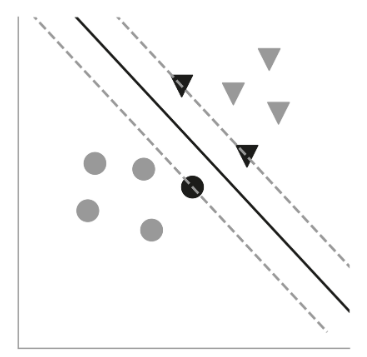
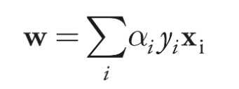
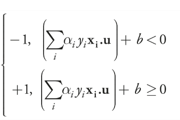

## Chapter 7

### Previous concepts

### Overview of Vapnik's algorithm for finding an optimal separating hyperplane

- Remembering: a separating hyperplane is a lineal boundary between two regions in the coordinate space (it divides the space in two)
- To separate data into two clusters using a hyperplane, the data must be linearly separable
- Rosenblatt's perceptron finds a hyperplane that divides the labeled data, however is a random one and, hence, not the best possible
- Vapnik's algorithm finds the OPTIMAL SEPARATING HYPERPLANE, meaning the one that minimizes prediction error. To do this it finds the hyperplane
that maximizes the margins between the two clusters of data, using the closest data points for each cluster as margin (called support vectors since the data points are vectors). The hyperplane is the line that goes through the middle of the path. \
\
By definition, the data is linearly separable, so this margin data points always exists. And the hyperplane is placed in the middle of "no-mans land".
- Maybe for some data this is not the best hyperplane, maybe the best one would be near the margin of some cluster, however this optimal hyperplane works best in most cases, and it allows us to have a defined method to find it. It's after all still probabilistic
- The number of margin data points for each cluster/class of data can be anything (greater than zero of course)
- The optimal hyperplane is characterized by the vector w (perperdicular to the hyperplane) and the bias b, its offset from the origin
- The weight vector that maximizes the separation between points on either side of the hyperplane can be found by minimizing the function |w|^2/2, where |w| is the magnitude of the weight vector, while simultaneously satisfying this equation for every data point xi (a vector) and its associated label, yi (a scalar, equal to -1 or +1): yi(w.xi + b) ≥ 1 (margin rule)
- This is a constrained optimization problem, where we cannot just simply optimize |w|^2/2, we have to satisfy certain condition, the margin rule. To do this we use Lagrange multipliers

### Lagrange Multipliers applied to Vapnik's algorithm

- [Visual explanation](https://www.youtube.com/watch?v=5A39Ht9Wcu0&ab_channel=SerpentineIntegral)
- It's a method used to find maximums and minimums in a function f restricted to some values, given by another function g
- It's based on the idea that the gradient of f is parallel to the gradient of g in the points where exists a maximum or minimum, meaning ∇f = λ∇g, where λ is a scalar multiple (since the two gradients have the same direction but not the same magnitude)
- Using this equality and the restriction function we can make a equation system to calculate the points where a maximum or minimum exists
- Going back to our original problem, if we use lagrange the weight vector turns out to be given by this formula:\
\
- Each αi (alpha sub-i) is a scalar and is specific to a given data point and its associated label, (xi, yi). These alphas are the Lagrange multipliers. Given some training data, specialized optimization techniques can give us the alphas
- It turns out that αi will be zero for samples that don’t lie on the margins, the support vectors
- The label for a new data point is given by the dot product of the weight vector plus the bias:\
\
- The optimal separating hyperplane depends only on the dot products of the support vectors with each other; and the decision rule, which tells us whether a new data point u is classified as +1 or -1, depends only on the dot product of u with each support vector

### Project data into higher-dimensional spaces and the kernel trick. Support Machine Vector

- In order for the Vapnik's algorithm to work, the data must be linearly separable. But there is a way to use this algorithm (and any other linear classifier that finds a separating hyperplane) with linearly inseparable data. If we project the data into higher-dimensional spaces it's more likely that the separating hyperplane exists. If we project the data to an infinite-dimensional space it will always exist a separating hyperplane
- This has two main problems, 1º) how do we create the new features/dimensions 2º) As we up the number of dimensions, the calculations become computationally impossible. It's important to note that the only calculation we need regarding the vectors (data vectors and w) is the dot product
- To create new features and up the number of dimensions there are mappings that transform the low-dimension vector into a high-dimension vector, xj → φ(xj), finding this mappings is not trivial, so we use the one that are already invented
- If we up the dimensions using one of this mappings, then we have a function (called kernel function) that K(xi, xj) → φ(xi). φ(xj). Meaning that if we make the dot product with the low dimension vectors, we get the output of the dot product of the high dimension vectors. This way we can work with low dimension vectors as if they were high dimension. So we dont even have to map the vectors to high dimension, we only need the kernel function
- There is a kernel function called RBF kernel that ups the dimensions to infinity. Allowing us to always find a separating hyperplane
- Going back to our algorithm, if we have linearly inseparable data, the only thing we need to do is replace the dot products with the kernel function, this algorithm is called SVM (Support Machine Vector)
