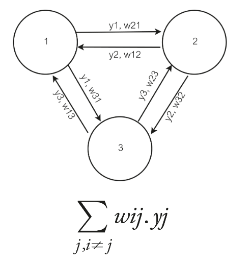
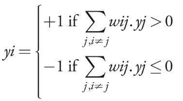
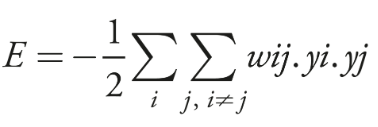

## Chapter 8

- A hopfield network is used to store some memories (for example images of digits), and then given an input it will return the most similar memory to that input

### Hopfield neuron

- It's a mix of Rosenblatt's perceptron and McCulloch-Pitts neuron
- The inputs of the neuron can only be 1 or -1, the output is calculated by multiplying each input by its corresponding weight and summing it all (dot product between weight vector and input vector)
- If the dot product is greater than zero, the neuron returns 1, if not returns -1
- In a Hopfield network all neurons are conected to each other, and there is no "external input". To input something you have to set it as the output of each neuron at the start of the network. Meaning for each "input feature" you need a neuron
- For the network to work as we want it to work, the weights need to be symmetric (meaning the weight w12 has to be equal to w21)
- At each instant, each neuron is outputing something, that is the output of the neuron, so to input something we change the output of each neuron and to read the output we read the output of each neuron when the system is stable
- If the network is stable it means the outputs of the neurons are the same each instant, they dont flip. This occurs when the "memory" the network has memorized appears, because we set the weights on purpose to behave like this
- The output of each neuron i can be described with this formula:

\
- The network at each state has a total "energy":\

- If we set the weights so that the network has some memories stored, each memory is a local minimum in this function

### How to train a Hopfield network so it stores a memory

- To calculate the weights between each pair of neurons, we simply have to multiply the desired output of each neuron in the memory we want to store
- For example, in the previous 3 neuron network, if we want to store y = \[1, -1, 1], the weights between neuron 1 and 2 are: w12 = w21 = y1 * y2 = 1 * -1 = -1
- If we do this, the network will behave as it was explained (mathematical coda in the book). Its also possible to store multiple memories
- If you have n neurons, the network can store at most 0.14×n memories
