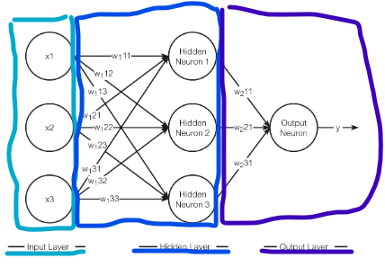
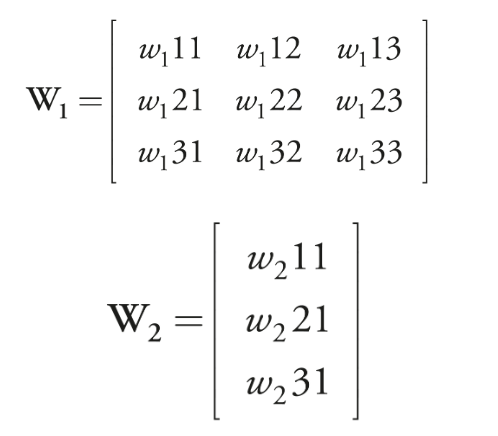
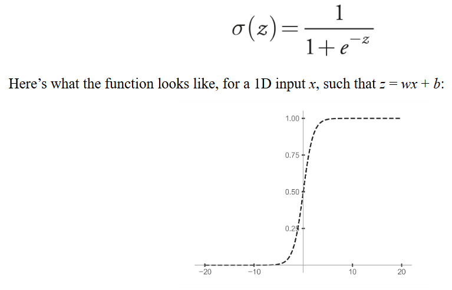

## Chapter 9

[Neural Networks and Deep Learning](http://neuralnetworksanddeeplearning.com/index.html)

### Multilayer/Deep neural networks (Multilayer perceptron)

- This chapter explains the most basic architecture of a neural network, the multilayer perceptron. Because is the easiest one to understand
- A multilayer neural network consists of three types of layers, input layer, hidden layers and output layer
- The input layer is simply the input data, for example if we want a network to classify images of cats and dogs, the input layer will be the numerical value of the pixels of the image we want to classify
- The hidden and output layers are perceptrons (weight, bias and activation function) stacked
- Each perceptron in a layer receives as input the output of all the perceptrons in the previous layer
- The input and output layers are mandatory. You can put 0 hidden layers if you want (that would be a single-layer neural network, we could train it with Rossenblat's algorithm)
- If the network has one or more hidden layers, we can say its a deep neural network:\
  
- The weights of each layer can be represented as a matrix:\
  
- Essentially, a deep neural network, with its multiple weight matrices, transforms an input x into an output y, where both the input and output are vectors. This can be written as: y = f(x). A neural network then approximates some desired function

### Explaining how a deep neural network can approximate any function

- Almost every problem can be though as a function (translating from one language to another, classifying images, generating output text based on input text...)
- As long as the network has one hidden layer it can do this things, the problem is that is difficult to build and train them -if the problem is also difficult- because we would need lots of perceptrons
- As we saw in earlier chapters, a perceptron first computes the weighted sum of the inputs, and then applies some step function. From now on, this step function will be called "activation function", and it can be any function, not only a step function
- For example, one that is broadly used is the sigmoid function:

- Taking a one hidden layer network as an example, the output layer what it does is add all the functions in the hidden layer. So basically what we are doing is approximate the desired function by constructing it with the output functions of the hidden layers

